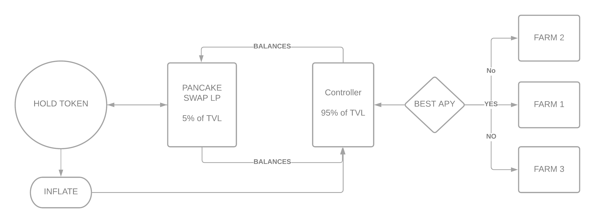

# HOLD FARM

__HOLD__ token generates passive income by allocating assets to other crypto farms, combining and picking best farming vaults. You just need to hold the __HOLD TOKEN__ to get profits, cutting messy process of STAKING and doing complex operations.

In Short, __HOLD__ token is backed by best APY asset from autofarm.network 

 
## Definitions :
 
 + __AutoFarm__ - AutoFarm is yet another yield optimizer on the Binance Smart Chain.
 
 + __HOLD__ -  Tokens 
 
 + __HOLDERS__ - Holders are the ones who Hold $HOLD tokens

  + __APR__ ( Annual Percentage Rate ) - APR is the full rate you will be charged throughout your Farming period

 

## Key Aspects :
 
 1. 3% of __HOLD__ is burned on every transaction.
 
 2. Supply increases by __12.96 HOLD__.
 
 3. Epoch Time is __6 hours__
 
 
## Theory :
 
  Since __HOLD__ Token is deflationary ( 1.1 ), we need to inflate it in some way and use that inflation (1.2) for farming.Every __Epoch__ New __HOLD__ are minted and then swapped to the best-performing asset on $AUTOFARM ( or similar farms )
 
 Example Assets APR on Autofarm :
 
 + BNB 60% APR 
 + CAKE 300% APR
 + USDT 30% APR
 
 
Now since CAKE has Highest __APR__, it's the best-returning Asset to invest in, Now controller will swap __HOLD__ generated in (1.2) to CAKE. Now the controller has __CAKE__ and it will Invest them in __Autofarm__ which will start generating returns With time our asset grows
 
## Example :
 
We invested 10000 CAKE and after 6 hours its 10040 CAKE these 40 CAKE interest that we generated will be used to buy back __HOLD__ elevating price for all __HOLDERS__.This makes it a infinite loop that keeps buying back __HOLD TOKEN__ and elevating its value over time

## Fees

1. 3% on transfer ( Burned )
2. 2% on farming profits ( Developers )

## Smart Contracts

| Name          |                  Address                   |
| ------------- | :----------------------------------------: |
| Token         | 0xb5e1f0264e249a593019f3893bd2272fb79bab05 |
| Controller    | 0x220c7030e0c0fc6239233b452d56021076684b56 |
| Farm          | 0x0895196562c7868c5be92459fae7f877ed450452 |

# FAQ

+ __Developer Fees__

Developer fee is 2% on generated profits, this goes to our tresury to ensure that we can cover development/upgrade costs.

+ __Token Transfer Burn__

Everytime someone transfers $HOLD token, 3% of the total transfer amount gets burned ( Deflating The Supply).

+ __Contribute__

Please edit our code on github and submit a pull request, someone from team will merge your commit.

+ __Blockchain $HOLD.FARM Use__

Our Codebase is based on Binance Smart Chain ( BSC ), please use supported wallets ( Google For More Details).

# Video

<video width="100%" height="100%" controls><source src="http://ipfs.io/ipfs/QmRZM5t69FMShosqwDHMTsF3RiJkBBGTBbj4XDmPdU9HgZ" type="video/mp4"></video>
