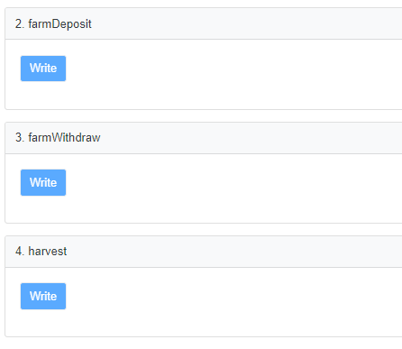

# HOLD FARM

HOLD token generates passive income by allocating assets to other crypto farms, combining and picking best farming vaults. You just need to hold the HOLD TOKEN to get profits, cutting messy process of STAKING and doing complex operations.

In Short, HOLD token is backed by best APY asset from autofarm.network 

## Fees

1. 2% on transfer ( Burned )
2. 2% on farming profits ( Developers )

## Smart Contracts

1. Token (0x593BDBAF7e65c51f5a35761cc688245a560E6a02)
2. Controller (0x220c7030e0c0fc6239233b452d56021076684b56)
3. Farm (0x0895196562c7868c5be92459fae7f877ed450452)

## Calling Funtions yourself

https://bscscan.com/address/0x220c7030e0c0fc6239233b452d56021076684b56#writeProxyContract

Calling harvest will execute logic for Hold.Farm, You can call any of these functions for yourself, whole farm is open to public and anyone can excute farm functions.

